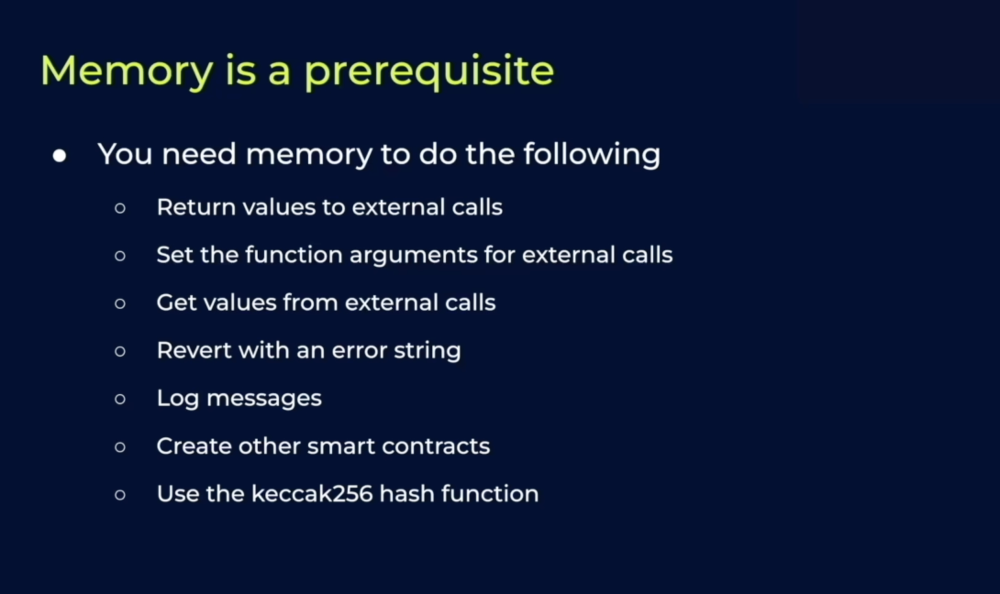

## Understanding how bit manupulation works
- https://youtu.be/NLKQEOgBAnw?si=Fz7Dkdm1LIHmwOcn

- https://chatgpt.com/share/67cc73e9-f180-8000-a4c0-8f7d0927e61b

## Storage in Yul
- https://github.com/andreitoma8/learn-yul?tab=readme-ov-file#storage-slots--variables

## Memory in Yul

- mstore8

## How Solidity uses memory:
- Solidity allocates slots [0x00-0x20], [0x20-0x40] for scratch space (first 2x32 bytes)
- Solidity reserves slot [0x40-0x60] as the free memory pointer (the location of the next free memory slot)
- Solidity keeps slot [0x60-0x80] empty which is the zero slot. It is used as initial value for dynamic memory arrays and should never be written to.
- The action begins at slot [0x80-...]

